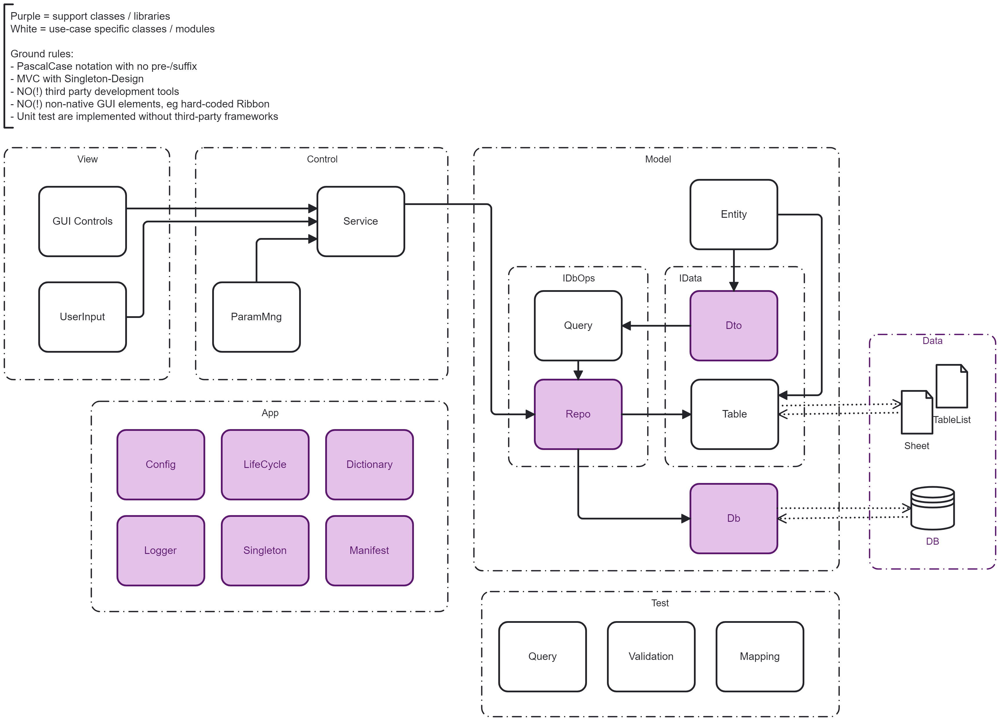

# Quality Check - MS Office VBA

This repository: 
- outlines our internal quality requirements
- is for evaluation purposes only
- does not disclose specific security design
- does not contain any customer-related information

## App Design

 

## Checklist VBA

- **README file** must be included in the VBA programming modules, accessible from the Visual Basic Editor. It must provide information regarding (a) documentation, (b) license, (c) support, (d) maintenance, (e) dependencies, (f) life cycle management (g) security, and (h) the publisher.
- **Requirements** must be documented in the "docs"-folder of the git repository, this includes system context, features and use cases. 
- **Code design** must be described in the "docs"-folder of the git repository. This includes programming pattern and future maintenance. The correct future adjustments should be enforced by using suitable interfaces. The design must be based on the of the widely recognized programming approaches such as MVC or DTO. Decoupling must be ensured by design. The VBA solution has to be testable, maintainable, and replaceable without disturbing the function of other components or solutions.
- **Development environment** must be completely separate from production and must contain only test data. The development environment must provide full data protection and by accessible only by authenticated users. The development environment must provide the same level of security as applied in the production.
- **Test data** must be sufficiently randomized, anonymised and pseudonymised, so that it does not contain any information protected by the GDRP, financial law or other regulation.
- **Secrets management** in the case of VBA has to take place on the OS level. The VBA scripts may never contain any credentials, login information or any other secrets. 
- **Coding guidelines** used must correspond to the customer's policies. By defaults: (a) PascalCase should be used for all modules, classes and variables, regardless of their scope or function, (b) singleton pattern should by applied for lean and efficient runtime, (c) the intended solution should build on top of the already existent architecture of the MS Office applications. 
- **Code review** must take place before every merge into the release branch. This is ensured by role division between developers and technical lead in every project. Developers can never merge into release branch directly.
- **Security review** must be carried out as part of code review. Potential code-based vulnerabilities, such as SQL injection, arise from fault implementation. Any discovered code-based security issues must be fixed immediately. 
- **Execution profiles** must be separate for (a) production and (b) development and testing. Each execution profile has to be configured separately.
- **Error handling** must be implement for all potential misbehaviours of the application. All errors must notify the user about the failed execution.
- **Logging** must be implemented for all errors. It should also provide information in regard to the use of the application, such as frequency of use, number of users and execution time. Log must not contain any personal, financial or other sensitive data.
- **Unit testing** must provide 100% coverage for any components deemed critical. This includes (a) any commands addressed to shared resource, such as a server, (b) actions that overwrite data outside the MS Office file, such as other local files (c) any actions that may cause overload of infrastructure (d) any actions that may cause data loss. The unit tests have to be structured in three sections: (1) arrange, (2) act, and (3) assert. For the implementation of the unit tests no open-source or third-party frameworks are allowed.
- **Compatibility** across different versions of the MS Office and Windows must be ensured. By default only GUI elements from the available form and active X controls must be used. Especially adding elements, such as custom ribbon buttons, by manually decompressing the xlsx/docx files must be avoided.
- **System testing** must be done in a test environment separate from the production. This test environment must match the production environment in terms of the tech stack.
- **Dependencies** have to be limited to the libraries which are already part of the official MS Office product. No open-source or third-party frameworks can be used. All dependencies must be documented in the README-file.
- **Integration testing** with file systems or backend database systems must be carried out in a test environment. This test environment must match the target infrastructure and setup. 
- **Deployment assets** must be cleaned up, especially in regard to unnecessary comments, unresolved issues, and temporary test assets. 
- **Configuration** must be separate from the application logic. Configuration must be defined for each execution profile and execution environment separately. The configuration files included in the repository may never contain any secrets or credentials.
- **Threat modelling** of the customer's systems must be considered. The VBA must function within the restrictions and security measures implemented in the target system.    
- **Vulnerability management** must be implemented for any components that are not an official part of the MS Office product. Such components may however not be used, unless exception is requested by the customer.
- **Code scans** must be executed on any component that is not an official part of the MS Office product. Such components may however not be used, unless exception is requested from the customer.
- **Manifest** must be included in the programmable objects. Its purpose is to validate the current version of the VBA. If the VBA is outdated, all functions must be disabled. The user must be notified that this version is no longer valid. 
- **Software recall** must be possible in the case of a faulty release. This can be done by changing the central registry information of the manifest.
- **Code integrity** must be ensured by a digital signature of a registered software publisher before every release.
- **Version control** must be implemented. All modules, classes and programmable objects must be exported into a git repository and tracked for changes.
- **LICENSE file** must be included in the VBA programming modules, accessible from the Visual Basic Editor.
 
